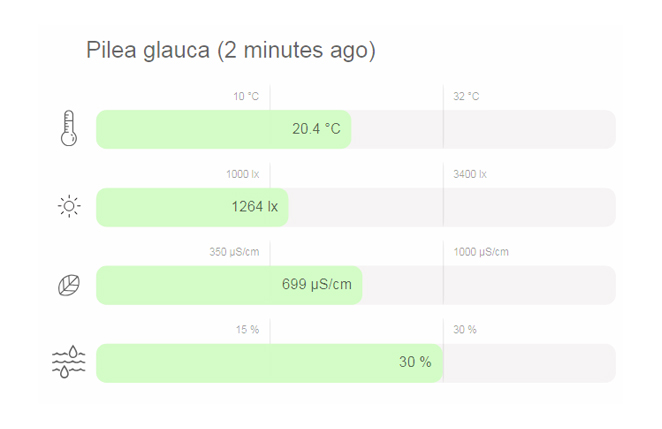

# Homey flora data dashboard
View the status of Xiaomi Mi Flora Plant Sensors

## How to install?
1. Run `npm install`.
2. Copy the `.env.dist` to `.env` and fill in the environment variables
3. Fill all the environment variables in the `.env` file.
3. Open `index.html` in the browser.

> note: After authentication you will be redirected to `http://localhost?code={uuid}`. This result in an: `404 Not found`. To init the script you need to add the `?code={uuid}` query to the url where your script runs e.g. 